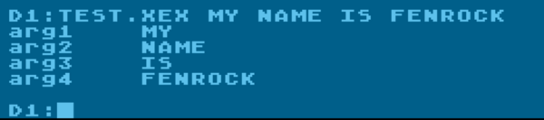

Example application of parsing command line args in spartaDosX

To build it:

```shell
$ fb main.bas getargs-sdx.asm
```

Copy the main.xex file into your target environment, e.g. Altirra.

Run as follows in your SDX environment (note, I've renamed it to test.xex in
image):


